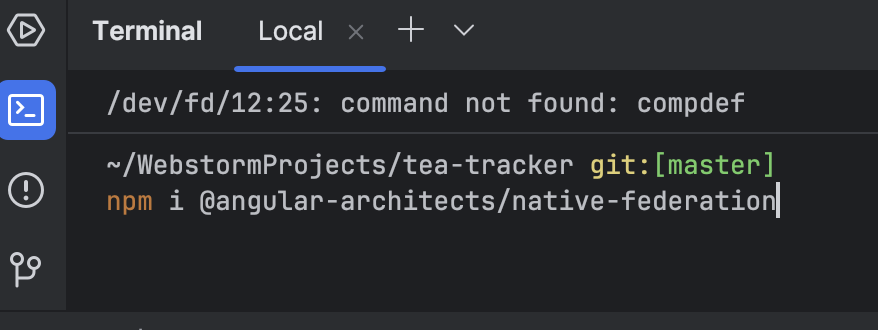
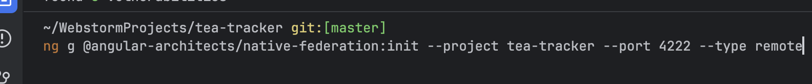
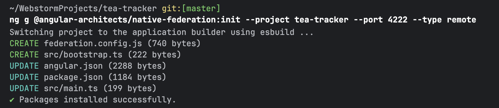

# Micro frontends in Angular
*Simple step-by-step tutorial*

## What are micro frontends?

Micro frontends are essentially the frontend equivalent of microservices.
Instead of building a single big frontend application, you split it into 
smaller, independently developed and deployed pieces, each responsible for 
a part of the UI.

The main idea is that you can have a large app (like a dashboard or e-commerce site) 
which is divided into self-contained part (frontend modules). Each module 
(or micro frontend) is owned by a separate team, has its own codebase, and can be 
deployed independently. The parent app (or container) gathers all these micro frontends
together into one cohesive UI.


## Why are micro frontends useful?

They are not always necessary, but they can be very useful in certain contexts. 
Such as:

- ***Independent Deployment*** - You can update a single feature without redeploying 
the whole frontend. For example in Teams, if the calendar needs a bug fix, the dev
team could only redeploy that micro frontend, without having to redeploy the whole 
Teams app.
- ***Team autonomy*** - Large teams can own separate micro frontends. They each have their
own codebase and schedules. And don't have to interfere with each-others development.
- ***Lazy Loading*** - Only load the micro frontends the user actually needs.
- ***Scalability*** - For a growing frontend codebase, micro frontends allow scaling 
without a huge monolithic app.


## How to use this architecture in Angular

### Prerequisites

At the time of this tutorial (jan 2026) i used the following versions of software:

- Node.js 22
- Angular CLI 21

### 1. Create an Angular app

This will be one of the micro frontends. It is a simple, stand alone
Angular application. In our example I will make a small tea tracker
as one of my micro frontends

You can create it from the command line:

```bash
ng new <app-name> --standalone --routing
cd <app-name>
```

Or from the Webstorm UI:


### 2. Add the dependencies

We use native-federation.



Initialise the project





### 3. Start the application


### 4. Observe the default app in the browser


### 5. Add your own code

Get creative, make whatever app you want. I made a small tea tracker.


### 6. Create the base app

Using the exact same steps as before, make another application
but this time use remote instead of dynamic host. Start the application 
on a different server.

### 7. Base app configuration

Inside the federation.manifest.json add the links to your microfrontends,
in my case:

```json
{
	"tea-tracker": "http://localhost:4222/remoteEntry.json",
	"sticky-notes": "http://localhost:4333/remoteEntry.json"
}
```

### 8. Load the micro frontend inside the base app

I loaded my component on a separate url path.

```javascript
{
    path: 'tea-tracker',
    loadComponent: () => loadRemoteModule('tea-tracker', './App').then((m) => m.App),
}
```

### 9. Run the base app and check the browser

Now in the browser, at your designated path you should see your micro frontend loaded.
(Note: you should make sure the micro frontend application is still up and running, 
a restart might be necessary if you`ve made any config changes).


I can see my home page, from my base app and i can see the two seperate micro frontends
from the same applicaiotn. 
