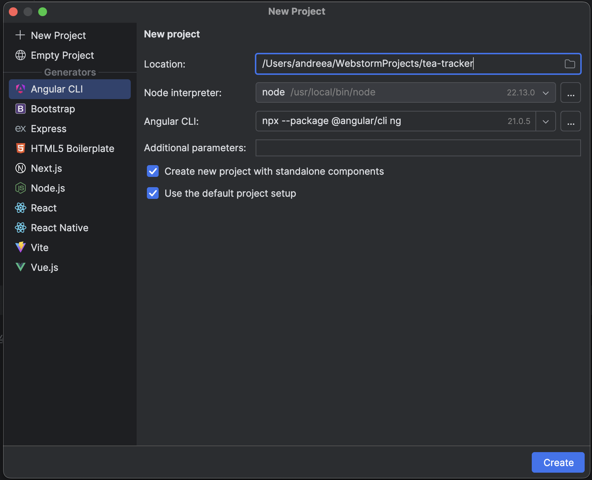
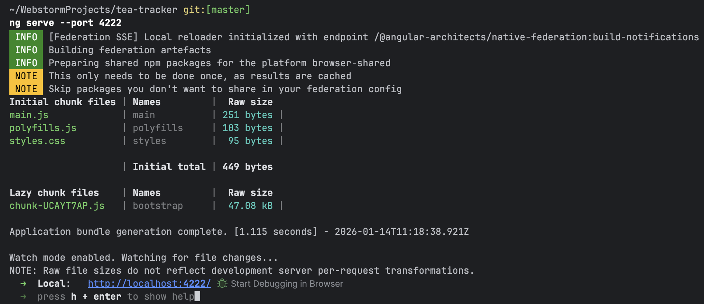
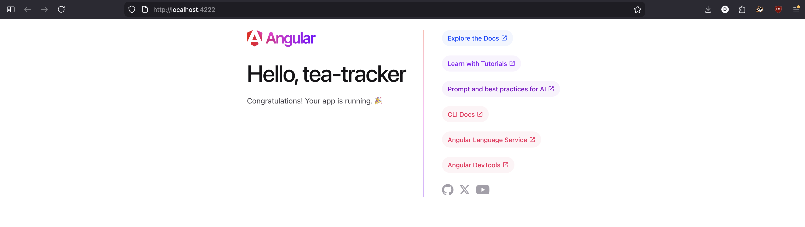
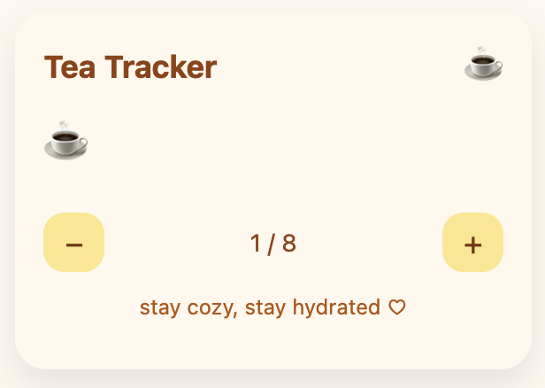
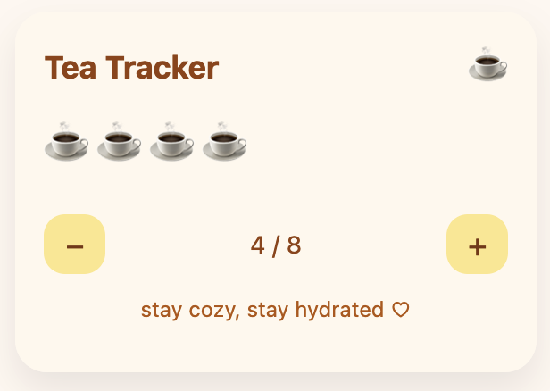
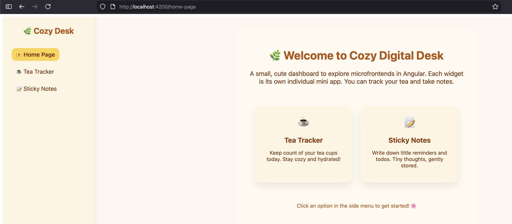
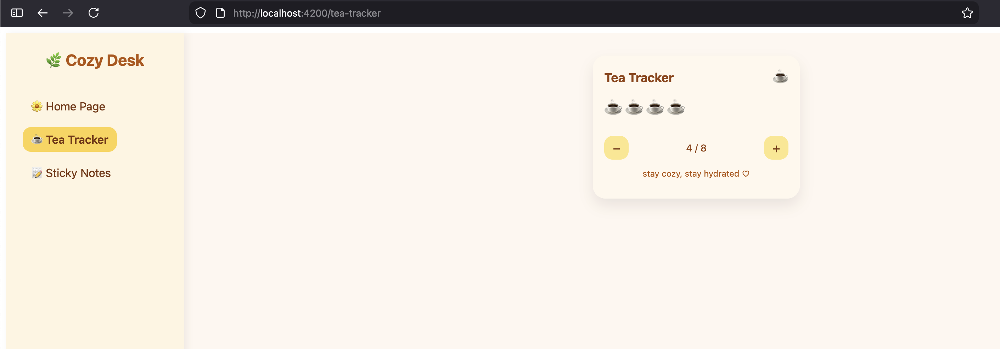
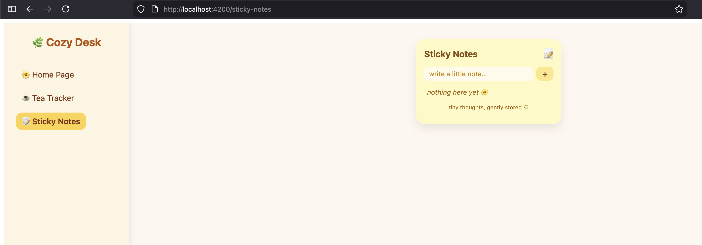

# Micro frontends in Angular
*Simple step-by-step tutorial*

## 📚 Table of Contents
- [What are Micro Frontends?](#what-are-micro-frontends)
- [Why Use Micro Frontends?](#why-are-micro-frontends-useful)
- [Prerequisites](#prerequisites)
- [Tutorial Overview](#tutorial-overview)
- [Part 1: Creating Your First Micro Frontend](#part-1-creating-your-first-micro-frontend)
- [Part 2: Creating the Base Application](#part-2-creating-the-base-application)
- [Part 3: Connecting Everything Together](#part-3-connecting-everything-together)

---

## What are micro frontends?

Micro frontends are essentially the frontend equivalent of microservices.
Instead of building a single big frontend application, you split it into 
smaller, independently developed and deployed pieces, each responsible for 
a part of the UI.

The main idea is that you can have a large app (like a dashboard or e-commerce site) 
which is divided into self-contained part (frontend modules). Each module 
(or micro frontend) is owned by a separate team, has its own codebase, and can be 
deployed independently. The parent app (or container) gathers all these micro frontends
together into one cohesive UI.

### The Architecture

In a micro frontend architecture, you have:

- **Base App (Container/Shell)**: The main application that hosts and orchestrates all micro frontends
- **Micro Frontends (Remote Apps)**: Individual, self-contained applications that each handle a specific feature or domain

In our example project, we'll build:
- A **base app** serving as our digital desktop
- A **tea tracker** micro frontend for tracking your tea drinking habits
- A **sticky notes** micro frontend for taking quick notes

## Why are micro frontends useful?

They are not always necessary, but they can be very useful in certain contexts. 
Such as:

- ***Independent Deployment*** - You can update a single feature without redeploying 
the whole frontend. For example in Teams, if the calendar needs a bug fix, the dev
team could only redeploy that micro frontend, without having to redeploy the whole 
Teams app.
- ***Team autonomy*** - Large teams can own separate micro frontends. They each have their
own codebase and schedules. And don't have to interfere with each-others development.
- ***Lazy Loading*** - Only load the micro frontends the user actually needs.
- ***Scalability*** - For a growing frontend codebase, micro frontends allow scaling 
without a huge monolithic app.


## How to use this architecture in Angular

### Prerequisites

At the time of this tutorial (jan 2026) i used the following versions of software:

- Node.js 22
- Angular CLI 21

### Installation

If you don't have Angular CLI installed:
```bash
npm install -g @angular/cli@21
```

Verify your installations:
```bash
node --version    # Should show v22.x.x or higher
ng version        # Should show Angular CLI 21.x.x
```

---

## Tutorial Overview

We'll build this in three main parts:

1. **Create the first micro frontend** (Tea Tracker)
2. **Create the base application** (Digital Desktop)
3. **Connect everything together** and add a second micro frontend (Sticky Notes)

By the end, you'll have a working digital desktop with two independently deployable micro frontends!


## Part 1: Creating Your First Micro Frontend

In this section, we'll create the Tea Tracker micro frontend - a standalone Angular application that tracks your tea consumption.

### Step 1: Create a New Angular Application

We'll start by creating a standard Angular application using the Angular CLI.

#### Option A: Using Command Line

Open your terminal and run:

```bash
ng new tea-tracker --standalone --routing
```

**What these flags mean:**
- `--standalone`: Creates an application using Angular's standalone components (no NgModules)
- `--routing`: Sets up Angular Router for navigation

You'll be prompted with two questions:

1. **"Would you like to add Angular routing?"** - Press `Y` (already handled by --routing flag)
2. **"Which stylesheet format would you like to use?"** - Choose your preference (CSS, SCSS, SASS, or LESS)

After answering, Angular CLI will:
- Create the project structure
- Install all necessary dependencies (this may take a few minutes)
- Set up the basic configuration files

Once complete, navigate into your project:
```bash
cd tea-tracker
```

#### Option B: Using WebStorm

1. Open WebStorm
2. Click **File → New → Project**
3. Select **Angular CLI** from the left sidebar
4. Configure your project:
    - **Project name**: tea-tracker
    - **Location**: Choose where to save the project
    - **Angular CLI**: Use the globally installed CLI
5. Click **Create**

WebStorm will create the project and automatically open it.



### Step 2: Add Native Federation

Native Federation is the technology that enables micro frontends. 
It allows multiple Angular applications to share code and components at runtime.

#### What is Native Federation?

Native Federation is Angular's recommended solution for micro frontends. It uses JavaScript's native module system to load remote applications dynamically. Think of it as a way for one Angular app to "import" another Angular app while both are running in the browser.

#### Installation

In your terminal (make sure you're in the tea-tracker directory):

```bash
ng add @angular-architects/native-federation
```

**What this command does:**
- Installs the native-federation package
- Modifies your Angular configuration
- Sets up the federation configuration files

#### Configuration

When prompted, you'll see:

**"Please choose the project to use for the initial @angular-architects/native-federation configuration"**
- Select: **tea-tracker**

**"What type of application is this?"**
- Select: **remote**

**Important:** Choose "remote" because this micro frontend will be loaded BY another application (the base app we'll create later).

**"What port should be used for the remote application?"**
- Enter: **4222**

This is the port where your tea tracker will run. Choose any available port - just remember it for later!

Alternatively you can just run the command:

```bash
ng g @angular-architects/native-federation:init --project tea-tracker --port 4222 --type remote
```

**What happens behind the scenes:**
- Creates `federation.config.js` - defines what this app exposes to other apps
- Updates `angular.json` - adds federation build configuration
- Creates `bootstrap.ts` - handles the dynamic bootstrapping required for federation

### Step 3: Start the Application

Now let's verify everything is working correctly.

#### Starting the application

Run the following command, use the port you specified:
```bash
ng serve --port 4222
```



### Step 4: View the Default Application

Open your web browser and navigate to:
```
http://localhost:4222/
```



You should see the default Angular welcome page with:
- The Angular logo
- Links to documentation
- Some example content

### 5. Add your own code

Get creative, make whatever app you want. I made a small tea tracker.





The project should look like this:
```
tea-tracker/
├── src/
│   ├── app/
│   │   ├── app.ts                ← Main component (we'll modify this)
│   │   ├── app.html              ← Template
│   │   └── app.css               ← Styles
│   ├── main.ts                   ← Application entry point
│   └── index.html                ← HTML shell
└──federation.config.js          ← Federation configuration
```

Create what components you want and then in the `federation.config.js` 
modify the configuration:

```javascript
const {
  withNativeFederation,
  shareAll,
} = require('@angular-architects/native-federation/config');

module.exports = withNativeFederation({
  name: 'tea-tracker',

  exposes: {
    './App': './src/app/app.component.ts',
  },

  shared: {
    ...shareAll({
      singleton: true,
      strictVersion: true,
      requiredVersion: 'auto',
    }),
  },

  skip: [
    'rxjs/ajax',
    'rxjs/fetch',
    'rxjs/testing',
    'rxjs/webSocket',
  ],
});
```

- **`name: 'tea-tracker'`**: The identifier for this micro frontend
- **`exposes`**: What this app makes available to others
    - `'./App'`: The name other apps will use to import this
    - `'./src/app/app.component.ts'`: The actual file being exposed
- **`shared`**: Which dependencies are shared between apps
    - `singleton: true`: Only one instance of shared libraries
    - `strictVersion: true`: Enforce version compatibility
- **`skip`**: Dependencies that shouldn't be shared (to reduce bundle size)

After saving this file, restart your development server:
```bash
ng serve --port 4222
```

## Part 2: Creating the Base Application

Now we'll create the main application - our digital desktop - that will host all micro frontends.
We will use mostly the same steps.

### Step 1: Create the Base Application

Open a **new terminal window** (keep the tea-tracker server running!) and navigate to your projects directory:

```bash
cd ..  # Go back to parent directory
ng new digital-desktop --standalone --routing
cd digital-desktop
```

Answer the prompts:
- Routing: **Yes**
- Stylesheet: Your preference (I recommend SCSS for this project)

### Step 2: Add Native Federation

Just like before, add Native Federation, but this time with different settings:

```bash
ng add @angular-architects/native-federation
```

When prompted:

**"What type of application is this?"**
- Select: **dynamic-host**

**Important:** Choose "dynamic-host" (NOT "remote") because this app will LOAD other apps.

**"What port should be used?"**
- Enter: **4200** (the default Angular port)

**What's the difference?**
- **remote**: An app that will be loaded BY others (like tea-tracker)
- **dynamic-host**: An app that LOADS others (like our base app)

### Step 3: Create components

Add whatever code you desire. To add your micro frontends to this app we will use routing

#### Update src/app/app.routes.ts:

```typescript
import { Routes } from '@angular/router';
import { HomeComponent } from './home/home.component';
import { loadRemoteModule } from '@angular-architects/native-federation';

export const routes: Routes = [
  {
    path: '',
    component: HomeComponent
  },
  {
    path: 'tea-tracker',
    loadComponent: () =>
      loadRemoteModule('tea-tracker', './App').then((m) => m.App),
  }
];
```

**Understanding this routing configuration:**

- **`path: ''`**: The home route (http://localhost:4200/)
    - Loads our `HomeComponent`

- **`path: 'tea-tracker'`**: The tea tracker route (http://localhost:4200/tea-tracker)
    - Uses `loadRemoteModule()` to dynamically load the remote micro frontend
    - First parameter: `'tea-tracker'` - must match the name in the remote's `federation.config.js`
    - Second parameter: `'./App'` - must match the key in the remote's `exposes` configuration
    - Returns the `AppComponent` from the loaded module

### Step 5: Configure the Federation Manifest

The manifest file tells the base app where to find each micro frontend.

#### Create/Update src/assets/federation.manifest.json:

First, ensure the assets directory exists:
```bash
mkdir -p src/assets
```

Then create the manifest file:

```json
{
  "tea-tracker": "http://localhost:4222/remoteEntry.json"
}
```

**Breaking down the manifest:**
- **Key** (`"tea-tracker"`): Must match the `name` in the remote's `federation.config.js`
- **Value** (`"http://localhost:4222/remoteEntry.json"`): The URL where Native Federation can find this remote app
    - Port 4222: The port where tea-tracker is running
    - `/remoteEntry.json`: A special file Native Federation generates that describes what the remote app exposes


#### Update src/main.ts to load the manifest (this should happen automatically):

Replace the content with:

```typescript
import { initFederation } from '@angular-architects/native-federation';

initFederation('/assets/federation.manifest.json')
  .catch((err) => console.error(err))
  .then((_) => import('./bootstrap'))
  .catch((err) => console.error(err));
```

**What this does:**
1. **`initFederation()`**: Initializes the federation system
    - Loads the manifest file
    - Discovers available micro frontends
    - Sets up the module loading infrastructure
2. **`.then((_) => import('./bootstrap'))`**: After federation is ready, bootstrap the Angular app
3. **Error handling**: Logs any errors during initialization

## Part 3: Connecting Everything Together

### Step 1: Start All Applications

You need BOTH applications running simultaneously. This is crucial for micro frontends to work.

#### Terminal 1 - Tea Tracker:
```bash
cd tea-tracker
ng serve --port 4222
```

#### Terminal 2 - Base App:
```bash
cd digital-desktop
ng serve --port 4200
```

### Step 2: Test in the Browser

Open your browser and navigate to:
```
http://localhost:4200/
```







I can see my home page, from my base app and I can see the two separate micro frontends
from the same application.

**What just happened?**
- The base app loaded at port 4200
- When you clicked "Tea Tracker", it dynamically fetched the code from port 4222
- The micro frontend loaded seamlessly into the base app
- All without a page refresh!


